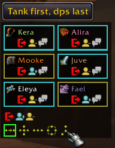
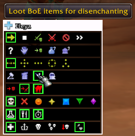

# Mangosbot UI (WoW client addon)
## Installation
Checkout all files to your Interface/Addons/Mangosbot folder (Mangosbot needs to be created first).

## Bot Roster
Run `/bot` command in WoW to bring Bot Roster window. Click `Login` buttons on appropriate bot window to bring this bot online.

## Bot Controls
Select your bot to bring Bot Controls window. Use numerous buttons to control your bot actions.

